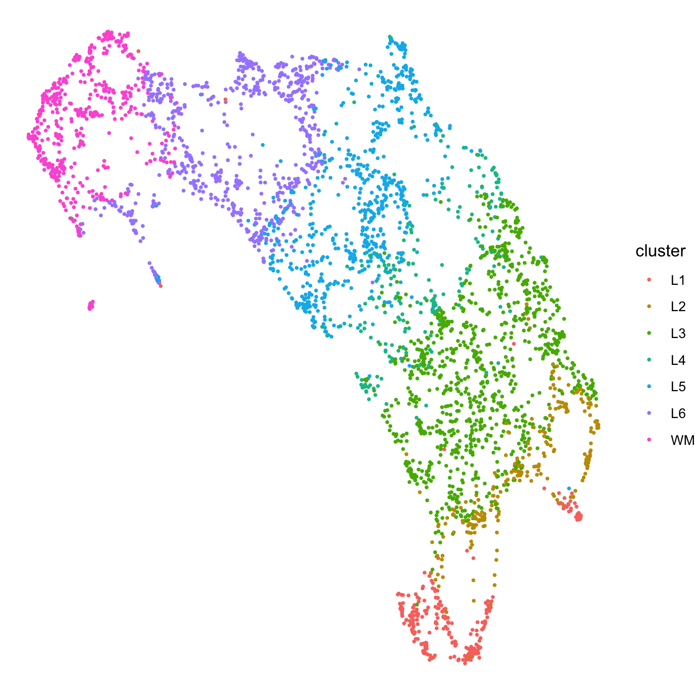
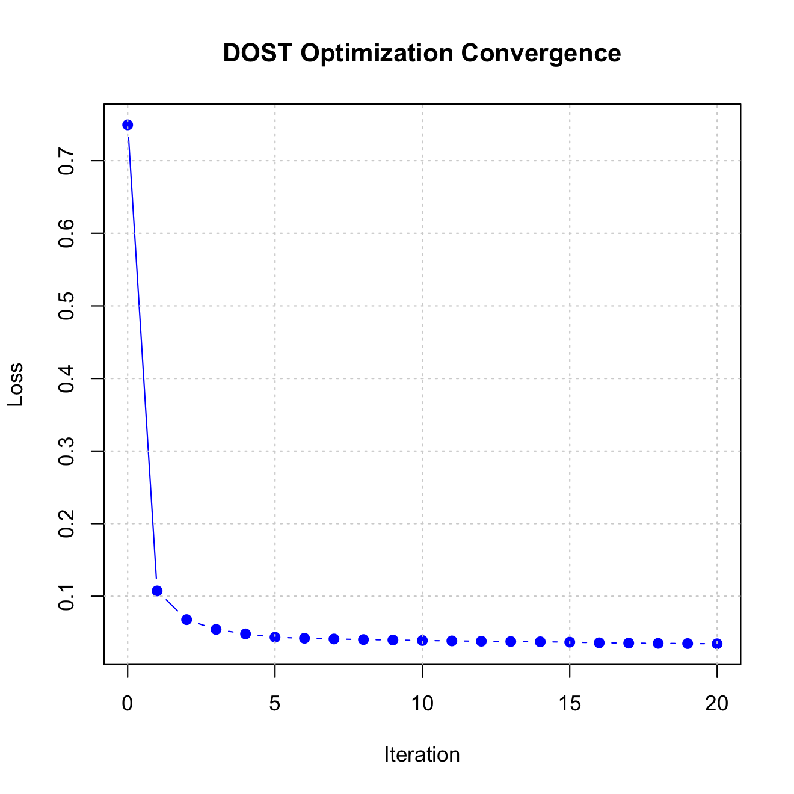

# Reproducing Spatial Domain Identification of DLPFC with DOST

## Introduction

This vignette demonstrates how to reproduce the DLPFC results presented
in our article using the `DOST` package.

To ensure our results match the manuscript exactly, we use the specific
version of the DLPFC dataset provided by the [Benchmark
ST](https://benchmarkst-reproducibility.readthedocs.io/en/latest/Data%20availability.html)
study.

## 1. Data Preparation

Please follow these steps to prepare the data:

1.  Go to the [Zenodo Repository](https://zenodo.org/records/10698880)
    and download the **DLPFC12.zip** file.
2.  Unzip the file.
3.  Note the path to the parent folder called “DLPFC12”. We will refer
    to this as `dir.input` in the code below.

## 2. Define Helper Functions

We use a custom loader function to parse the specific directory
structure of this benchmark dataset and attach the ground truth layer
annotations (L1-L6, WM) to the Seurat object.

``` r
library(DOST)
library(Seurat)
library(ggplot2)

# Custom loader for the Benchmark ST Reproducibility dataset structure
load_DLPFC_sample <- function(slice.id, dir.input) {
  filename <- paste0(slice.id, "_filtered_feature_bc_matrix.h5")
  data.dir <- file.path(dir.input, slice.id)
  
  if (!dir.exists(data.dir)) {
    stop(paste("Directory not found:", data.dir))
  }

  sp_data <- Seurat::Load10X_Spatial(data.dir, filename = filename, filter.matrix = FALSE)
  
  # Add the annotations 
  gt_file <- file.path(data.dir, 'gt', 'tissue_positions_list_GTs.txt')
  if (!file.exists(gt_file)) {
    stop("Ground truth file missing. Ensure you downloaded the full benchmark zip.")
  }

  df_meta <- read.table(gt_file, sep = ",", row.names = 1)
  common_cells <- colnames(sp_data[["Spatial"]]) %in% rownames(df_meta)
  sp_data <- sp_data[, common_cells]
  
  layer.data <- data.frame()
  layers <- c('L1', 'L2', 'L3', 'L4', 'L5', 'L6', 'WM')
  
  for (l in layers) {
    filename <- paste0(slice.id, "_", l, "_barcodes.txt")
    filename <- file.path(data.dir, 'gt', 'layered', filename)
    if (!file.exists(filename)) next
    data.temp <- read.table(filename)
    data.temp <- data.frame(barcode = data.temp[,1], layer = l, row.names = data.temp[,1])
    layer.data <- rbind(layer.data, data.temp)
  }
  
  sp_data <- SeuratObject::AddMetaData(sp_data, metadata = df_meta['V3'], col.name = 'row') 
  sp_data <- SeuratObject::AddMetaData(sp_data, metadata = df_meta['V4'], col.name = 'col')
  sp_data <- SeuratObject::AddMetaData(sp_data, metadata = layer.data['layer'], col.name = 'layers')
  
  return(sp_data)
}
```

## 3. Load Data

Now we load sample **151673**.

*Note: In the code below, replace `"path/to/DLPFC12"` with the actual
path where you unzipped the data.*

``` r
# Set this to the folder where you unzipped DLPFC12.zip
# e.g., "~/Downloads/DLPFC12"
dir.input <- "path/to/DLPFC12" 
slice_id <- "151673"

# Load the sample using the helper function
sample <- load_DLPFC_sample(slice_id, dir.input)

# Extract inputs for DOST
X <- Seurat::GetAssayData(sample, layer = "counts")
coords <- Seurat::GetTissueCoordinates(sample, scale = 'hires')[1:2]

# Extract the ground truth labels
gt <- sample@meta.data$layers
```

## 4. Run DOST

We run the DOST algorithm using the recommended settings for 10x Visium
data:

- **R = 7**: The DLPFC structure is known to have layers L1-L6 plus
  White Matter (WM).
- **lambda = 0.03**: The recommended regularization weight for Visium.
- **refinement = TRUE**: Recommended for laminar tissues like the
  cortex.

``` r
results <- DOST(
  X = X, 
  coords = coords, 
  R = 7, 
  lambda = 0.03, 
  refinement = TRUE
)
```

## 5. Visualization

We can visualize the resulting spatial domains and the UMAP
representation of the low dimensional DOST embedding.

``` r
# Visualize Spatial Domains
sample@meta.data[["DOST"]] <- results$labels
p1 <- Seurat::SpatialDimPlot(sample, group.by = "DOST", pt.size.factor = 2.5) +
  Seurat::NoLegend()
print(p1)
```


``` r
# Visualize UMAP with ground truth labels
p2 <- plot_DOST_umap(
  Z = results$Z, 
  labels = gt
)
print(p2)
```



## 6. Validation (ARI)

Since we have the ground truth annotations for this dataset, we can
easily calculate the Adjusted Rand Index (ARI) to quantify performance.

``` r
ari_score <- mclust::adjustedRandIndex(results$labels, gt)

cat(paste("Adjusted Rand Index (ARI):", round(ari_score, 3)))
```

Adjusted Rand Index (ARI): 0.597

## 7. Diagnostics

Finally, it is good practice to inspect the optimization history to
ensure the algorithm has converged. The `losses` element in the results
list tracks the objective function value at each iteration.

``` r
# Create a sequence for iterations starting at 0
iterations <- 0:(length(results$losses) - 1)

# Plot the optimization loss
plot(iterations, results$losses, type = "b", pch = 19, col = "blue",
     xlab = "Iteration", ylab = "Loss",
     main = "DOST Optimization Convergence")
grid()
```


